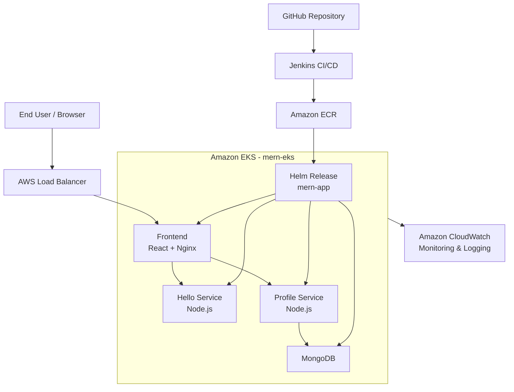
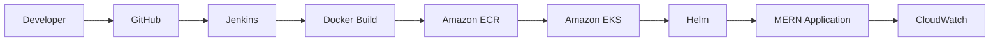

# MERN Microservices — AWS EKS Orchestration, Scaling & CI/CD


## 1. Project Overview

This project demonstrates containerization, CI/CD, deployment, orchestration, scaling, monitoring, logging, and validation of a MERN-based microservices application on AWS.

Application components:
- React frontend
- Node.js Hello microservice
- Node.js Profile microservice
- MongoDB

Technology/services:
- GitHub
- Docker
- Amazon ECR
- Jenkins
- Amazon EKS
- Helm
- AWS Load Balancer
- Amazon CloudWatch

---

## 2. Assignment Scope

This implementation addresses the graded project requirements:

1. Version Control with Git
2. MERN Application Preparation
3. Docker Containerization
4. Amazon ECR
5. AWS Environment Setup
6. Jenkins Continuous Integration
7. Amazon EKS
8. Helm Deployment
9. Monitoring and Logging
10. Documentation
11. Final Validation

**Bonus ChatOps:** SNS + Slack/Teams/Telegram was not implemented.

---

# 3. Solution Architecture



---

# 4. AWS Environment

| Component | Value |
|---|---|
| AWS Region | `us-east-1` |
| AWS Account | `874551618373` |
| EKS Cluster | `mern-eks` |
| Kubernetes Namespace | `mern` |
| Helm Release | `mern-app` |
| Worker Node Group | `mern-workers` |
| Container Registry | Amazon ECR |

**Security:** AWS access keys/secrets are not stored in this repository. Jenkins uses the configured AWS credential `mern-aws-ecr`.

---

# 5. Repository Structure

```text
.
├── README.md
├── Jenkinsfile
├── backend
│   ├── helloService
│   │   ├── Dockerfile
│   │   ├── .dockerignore
│   │   ├── index.js
│   │   ├── package.json
│   │   └── package-lock.json
│   └── profileService
│       ├── Dockerfile
│       ├── .dockerignore
│       ├── index.js
│       ├── package.json
│       └── package-lock.json
├── frontend
│   ├── Dockerfile
│   ├── .dockerignore
│   ├── nginx.conf
│   ├── package.json
│   ├── package-lock.json
│   ├── public
│   └── src
├── helm
│   └── mern-app
│       ├── Chart.yaml
│       ├── values.yaml
│       └── templates
│           ├── frontend.yaml
│           ├── hello.yaml
│           ├── mongodb.yaml
│           └── profile.yaml
├── phase2-build-push-ecr.sh
├── phase2-ecr-report.txt
├── phase3-deploy-clean.sh
├── phase3-deployment-report.txt
├── phase3-fix-profile.sh
├── phase3-profile-fix-report.txt
├── phase4a-cloudwatch-diagnose.sh
├── phase4a-cloudwatch-diagnosis.txt
├── phase4a-cloudwatch.sh
├── phase4a-cloudwatch-fix-report.txt
└── phase4a-fix-cloudwatch-capacity.sh
```

---

# 6. Version Control with Git

Repository:

https://github.com/risingali-new/SampleMERNwithMicroservices

Final validation confirmed the local `main` branch matches `origin/main` and the working tree is clean.

### Evidence

> **SCREENSHOT PLACEHOLDER — GitHub Repository**  


>
> **PASTE SCREENSHOT HERE**

---

# 7. Docker Containerization

Dockerfiles were created for:

```text
backend/helloService/Dockerfile
backend/profileService/Dockerfile
frontend/Dockerfile
```

Application images:

```text
hello-service
profile-service
mern-frontend
```

Example build commands:

```bash
docker build -t hello-service ./backend/helloService
docker build -t profile-service ./backend/profileService
docker build -t mern-frontend ./frontend
```

### Evidence

> **SCREENSHOT PLACEHOLDER — Docker Images**  
> Capture Docker image/build verification.  
>


---

# 8. Amazon ECR

Three individual ECR repositories were created:

```text
hello-service
profile-service
mern-frontend
```

Verification:

```bash
aws ecr describe-repositories --region us-east-1

aws ecr describe-images   --repository-name hello-service   --region us-east-1

aws ecr describe-images   --repository-name profile-service   --region us-east-1

aws ecr describe-images   --repository-name mern-frontend   --region us-east-1
```

Final Jenkins validation confirmed image tags including:

```text
hello-service:
v1
v2
latest

profile-service:
v1
v2
latest

mern-frontend:
v1
v2
v3
latest
```

### Evidence

> **SCREENSHOT PLACEHOLDER — Amazon ECR**  
> Capture all three ECR repositories and image tags.  
>


---

# 9. AWS Environment Setup

AWS identity was validated using:

```bash
aws sts get-caller-identity
```

Environment:

```text
Account: 874551618373
Region : us-east-1
```

### Evidence

> **SCREENSHOT PLACEHOLDER — AWS Identity**  
> Capture `aws sts get-caller-identity` and AWS region.  
>


---

# 10. Jenkins CI/CD

Pipeline file:

```text
Jenkinsfile
```

AWS credential used by the pipeline:

```text
mern-aws-ecr
```

## Pipeline Stages

```text
Checkout
    ↓
Verify Source
    ↓
AWS Identity
    ↓
ECR Login
    ↓
Build Hello Service
    ↓
Build Profile Service
    ↓
Build Frontend
    ↓
Push Images
    ↓
Verify ECR
    ↓
SUCCESS
```

The pipeline:

1. Checks out GitHub source.
2. Validates the project.
3. Authenticates to AWS.
4. Logs into ECR.
5. Builds all three Docker images.
6. Pushes images to ECR.
7. Verifies the ECR repositories.
8. Logs out of ECR.

Final Jenkins validation:

```text
JENKINS CI/CD SUCCESS
Images pushed successfully.
Build: 2
Tag: v2
Finished: SUCCESS
```

### Evidence

> **SCREENSHOT PLACEHOLDER — Jenkins Successful Pipeline**  
> Capture Build #2 showing successful stages and final success.  
>


> **SCREENSHOT PLACEHOLDER — Jenkins AWS Credential Validation**  
> Capture successful AWS identity validation. Do not expose any secret.  
>
> **PASTE SCREENSHOT HERE**

---

# 11. Amazon EKS

Cluster:

```text
mern-eks
```

Region:

```text
us-east-1
```

Worker node group:

```text
mern-workers
```

The cluster was validated as `ACTIVE` and the worker node as `Ready`.

Verification:

```bash
aws eks describe-cluster   --name mern-eks   --region us-east-1

kubectl get nodes -o wide
```

### Evidence

> **SCREENSHOT PLACEHOLDER — EKS Cluster**  
> Capture AWS EKS console showing `mern-eks` as ACTIVE.  
>


> **SCREENSHOT PLACEHOLDER — EKS Worker Node**  
> Capture `kubectl get nodes -o wide` showing `Ready`.  
>


---

# 12. Kubernetes Workloads

Namespace:

```text
mern
```

Application workloads:

```text
frontend
hello-service
profile-service
mongodb
```

Verification:

```bash
kubectl get deployments -n mern
kubectl get pods -n mern
kubectl get services -n mern
```

### Evidence

> **SCREENSHOT PLACEHOLDER — Kubernetes Pods**  
> Capture `kubectl get pods -n mern` showing application pods Running/Ready.  
>
> **PASTE SCREENSHOT HERE**

---

# 13. Kubernetes Services

| Service | Type | Port |
|---|---|---:|
| frontend | LoadBalancer | 80 |
| hello-service | ClusterIP | 3001 |
| profile-service | ClusterIP | 3002 |
| mongodb | ClusterIP | 27017 |

The frontend is externally accessible through the AWS Load Balancer. Backend and database services are internal Kubernetes services.

### Evidence

> **SCREENSHOT PLACEHOLDER — Kubernetes Services**  
> Capture `kubectl get svc -n mern`.  
>
> **PASTE SCREENSHOT HERE**

---

# 14. Helm Deployment

Helm chart:

```text
helm/mern-app
```

Files:

```text
Chart.yaml
values.yaml
templates/frontend.yaml
templates/hello.yaml
templates/mongodb.yaml
templates/profile.yaml
```

Validation:

```bash
helm lint helm/mern-app
```

Final validation:

```text
1 chart(s) linted, 0 chart(s) failed
```

Release:

```text
mern-app
```

Namespace:

```text
mern
```

Verification:

```bash
helm list -n mern
helm status mern-app -n mern
```

### Evidence

> **SCREENSHOT PLACEHOLDER — Helm**  
> Capture Helm lint and Helm release status.  
>
> **PASTE SCREENSHOT HERE**

---

# 15. Frontend Validation

Frontend service:

```text
LoadBalancer
Port 80
```

Verification:

```bash
kubectl get svc frontend -n mern
```

### Evidence

> **SCREENSHOT PLACEHOLDER — Frontend Application**  
> Open the AWS Load Balancer URL and capture the working application.  
>
> **PASTE SCREENSHOT HERE**

---

# 16. Hello Service Validation

API:

```text
/api/hello
```

Expected:

```json
{
  "msg": "Hello World"
}
```

Example:

```bash
curl http://<LOAD_BALANCER>/api/hello
```

### Evidence

> **SCREENSHOT PLACEHOLDER — Hello API**  
> Capture successful `/api/hello` response.  
>
> **PASTE SCREENSHOT HERE**

---

# 17. Profile Service Validation

Endpoints:

```text
GET  /health
POST /addUser
GET  /fetchUser
```

Add user:

```bash
curl -i -X POST -H "Content-Type: application/json" -d '{"name":"Test User","age":30}' http://<LOAD_BALANCER>/api/profile/addUser
```

Validated response:

```text
HTTP/1.1 201 Created
```

Fetch user:

```bash
curl -i http://<LOAD_BALANCER>/api/profile/fetchUser
```

Validated response:

```text
HTTP/1.1 200 OK
```

The created user was successfully returned.

### Evidence

> **SCREENSHOT PLACEHOLDER — Profile POST**  
> Capture HTTP 201 response from `/api/profile/addUser`.  
>
> **PASTE SCREENSHOT HERE**

> **SCREENSHOT PLACEHOLDER — Profile GET**  
> Capture HTTP 200 response from `/api/profile/fetchUser` with returned user.  
>
> **PASTE SCREENSHOT HERE**

---

# 18. MongoDB Validation

MongoDB is deployed inside the EKS cluster:

```text
Service: mongodb
Port: 27017
```

Successful profile creation and retrieval demonstrate application-to-MongoDB connectivity.

### Evidence

> **SCREENSHOT PLACEHOLDER — MongoDB / Database Validation**  
> Capture MongoDB pod/service and/or successful Profile API database validation.  
>
> **PASTE SCREENSHOT HERE**

---

# 19. Monitoring and Logging — CloudWatch

Amazon CloudWatch is used for monitoring/logging of the EKS environment.

Repository artifacts:

```text
phase4a-cloudwatch.sh
phase4a-cloudwatch-diagnose.sh
phase4a-fix-cloudwatch-capacity.sh
phase4a-cloudwatch-diagnosis.txt
phase4a-cloudwatch-fix-report.txt
```

CloudWatch resources should be validated from the AWS console before final submission.

### Evidence

> **SCREENSHOT PLACEHOLDER — CloudWatch Monitoring**  
> Capture CloudWatch monitoring/observability information.  
>
> **PASTE SCREENSHOT HERE**

> **SCREENSHOT PLACEHOLDER — CloudWatch Logs**  
> Capture CloudWatch Logs showing relevant Kubernetes/application logs.  
>
> **PASTE SCREENSHOT HERE**

---

# 20. Scaling

The application is deployed as Kubernetes Deployments, allowing replicas to be increased independently.

Example:

```bash
kubectl scale deployment frontend --replicas=2 -n mern
kubectl scale deployment profile-service --replicas=2 -n mern
```

Verify:

```bash
kubectl get deployments -n mern
```

The EKS managed node group also provides configurable node capacity.

### Evidence

> **SCREENSHOT PLACEHOLDER — Scaling**  
> Capture EKS node-group scaling configuration and/or Kubernetes replica scaling.  
>
> **PASTE SCREENSHOT HERE**

---

# 21. End-to-End CI/CD Flow



---

# 22. Troubleshooting and Resolutions

## EKS Cluster Creation

An existing CloudFormation stack initially prevented creation. The existing `mern-eks` cluster was subsequently verified as `ACTIVE`.

## Profile Service

The Profile Service initially returned an empty user list. Application routing and deployment were corrected and validated.

Final testing:

```text
POST /api/profile/addUser → HTTP 201
GET  /api/profile/fetchUser → HTTP 200
```

## Jenkins ECR Verification

The initial ECR verification used AWS CLI table formatting:

```text
--query 'imageDetails[].imageTags'
--output table
```

The frontend repository returned a structure that caused table formatting to fail.

The verification was changed to:

```text
--query 'imageDetails[].imageTags[]'
--output text
```

The subsequent Jenkins Build #2 completed successfully.

## CloudWatch

The CloudWatch observability add-on initially entered a degraded state during setup. Diagnostic and remediation scripts were used during troubleshooting.

---

# 23. Assignment Requirement Mapping

| Assignment Requirement | Implementation | Status |
|---|---|---|
| Fork/maintain Git repository | GitHub | ✅ |
| Prepare MERN application | MERN microservices | ✅ |
| Frontend Dockerfile | `frontend/Dockerfile` | ✅ |
| Backend Dockerfiles | Service Dockerfiles | ✅ |
| Push Docker images to ECR | Amazon ECR | ✅ |
| Individual ECR repositories | 3 repositories | ✅ |
| AWS CLI | AWS CLI | ✅ |
| Jenkins setup | Jenkins | ✅ |
| Jenkins AWS credentials | `mern-aws-ecr` | ✅ |
| Build/push through Jenkins | Jenkinsfile | ✅ |
| Automatic CI workflow | Jenkins pipeline | ✅ |
| EKS cluster | `mern-eks` | ✅ |
| Kubernetes worker nodes | `mern-workers` | ✅ |
| Helm packaging | `helm/mern-app` | ✅ |
| Helm deployment | `mern-app` release | ✅ |
| Frontend accessibility | AWS Load Balancer | ✅ |
| Backend services | Kubernetes ClusterIP | ✅ |
| MongoDB | Kubernetes Deployment/Service | ✅ |
| Monitoring | CloudWatch | ✅ |
| Logging | CloudWatch | ✅ |
| Documentation | README | ✅ |
| Final validation | API/frontend tests | ✅ |
| Scaling capability | Kubernetes/EKS | ✅ |
| ChatOps Bonus | SNS + Slack/Teams/Telegram | Not implemented |

---

# 24. Evidence Checklist

The following labelled placeholders are intentionally included so screenshots can be pasted directly below each section.

### Evidence 1 — GitHub Repository

> **PASTE SCREENSHOT HERE — GitHub Repository**

### Evidence 2 — Docker Images

> **PASTE SCREENSHOT HERE — Docker Images**

### Evidence 3 — Amazon ECR

> **PASTE SCREENSHOT HERE — ECR Repositories and Images**

### Evidence 4 — AWS Identity

> **PASTE SCREENSHOT HERE — AWS STS Identity**

### Evidence 5 — Jenkins Pipeline

> **PASTE SCREENSHOT HERE — Jenkins Successful Build**

### Evidence 6 — Jenkins AWS Credential

> **PASTE SCREENSHOT HERE — Jenkins AWS Credential Validation**
>
> **Do NOT expose secret access keys.**

### Evidence 7 — EKS Cluster

> **PASTE SCREENSHOT HERE — EKS Cluster ACTIVE**

### Evidence 8 — Kubernetes Nodes

> **PASTE SCREENSHOT HERE — kubectl get nodes**

### Evidence 9 — Kubernetes Pods

> **PASTE SCREENSHOT HERE — kubectl get pods -n mern**

### Evidence 10 — Kubernetes Services

> **PASTE SCREENSHOT HERE — kubectl get svc -n mern**

### Evidence 11 — Helm

> **PASTE SCREENSHOT HERE — Helm Lint and Release**

### Evidence 12 — Frontend

> **PASTE SCREENSHOT HERE — Working Frontend**

### Evidence 13 — Hello API

> **PASTE SCREENSHOT HERE — Hello Service API**

### Evidence 14 — Profile Add User

> **PASTE SCREENSHOT HERE — Profile POST 201**

### Evidence 15 — Profile Fetch User

> **PASTE SCREENSHOT HERE — Profile GET 200**

### Evidence 16 — MongoDB

> **PASTE SCREENSHOT HERE — MongoDB/Application Validation**

### Evidence 17 — CloudWatch Metrics

> **PASTE SCREENSHOT HERE — CloudWatch Metrics**

### Evidence 18 — CloudWatch Logs

> **PASTE SCREENSHOT HERE — CloudWatch Logs**

### Evidence 19 — Scaling

> **PASTE SCREENSHOT HERE — Kubernetes/EKS Scaling**

### Evidence 20 — Final Git Status

> **PASTE SCREENSHOT HERE — Final Git Status**

---

# 25. Final Validation Checklist

- [ ] GitHub repository accessible
- [ ] README committed
- [ ] Dockerfiles present
- [ ] ECR repositories exist
- [ ] ECR images available
- [ ] Jenkins pipeline successful
- [ ] Jenkins AWS credential validated
- [ ] EKS cluster ACTIVE
- [ ] Worker node Ready
- [ ] Kubernetes pods Running
- [ ] Kubernetes services available
- [ ] Helm release deployed
- [ ] Frontend accessible
- [ ] Hello API works
- [ ] Profile API works
- [ ] MongoDB connectivity demonstrated
- [ ] CloudWatch evidence captured
- [ ] Scaling evidence captured
- [ ] Required screenshots inserted
- [ ] Git working tree clean
- [ ] GitHub contains final commit
- [ ] VLearn submission document prepared

---

# 26. Cleanup After Submission

Do not delete AWS resources until all screenshots and submission evidence are captured.

After submission, the EKS cluster can be removed to avoid unnecessary charges:

```bash
eksctl delete cluster   --name mern-eks   --region us-east-1
```

Verify:

```bash
aws eks list-clusters --region us-east-1
```

Review ECR and CloudWatch resources separately before deletion.

---

# 27. Project Status

## Core Graded Assignment

**COMPLETED**

The implementation covers:

- Git version control
- Docker containerization
- Amazon ECR
- AWS CLI
- Jenkins CI/CD
- Amazon EKS
- Kubernetes
- Helm
- Monitoring
- Logging
- Scaling capability
- Documentation
- Final application validation

## Bonus ChatOps

**Not implemented**

The optional SNS + Slack/Teams/Telegram integration was excluded from the core submission.

---

# 28. Project Repository

**GitHub:**

https://github.com/risingali-new/SampleMERNwithMicroservices

**AWS Region:** `us-east-1`

**EKS Cluster:** `mern-eks`

**Namespace:** `mern`

**Helm Release:** `mern-app`

**Jenkins AWS Credential:** `mern-aws-ecr`

---

## Final Statement

This project demonstrates an end-to-end cloud-native MERN microservices deployment using AWS, Docker, Kubernetes, Helm, Jenkins, Amazon ECR, Amazon EKS, and Amazon CloudWatch.

The application was containerized, published to ECR, deployed to EKS through Helm, exposed using an AWS Load Balancer, validated through API testing, and integrated with Jenkins for CI/CD.

**Status: Core assignment completed and validated.**
